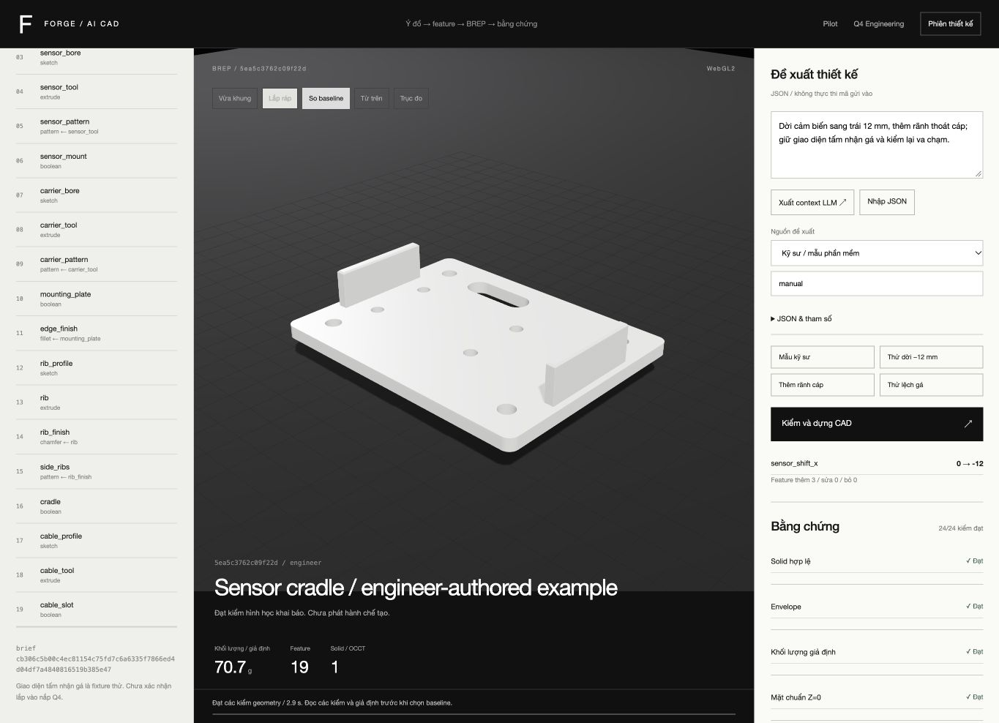
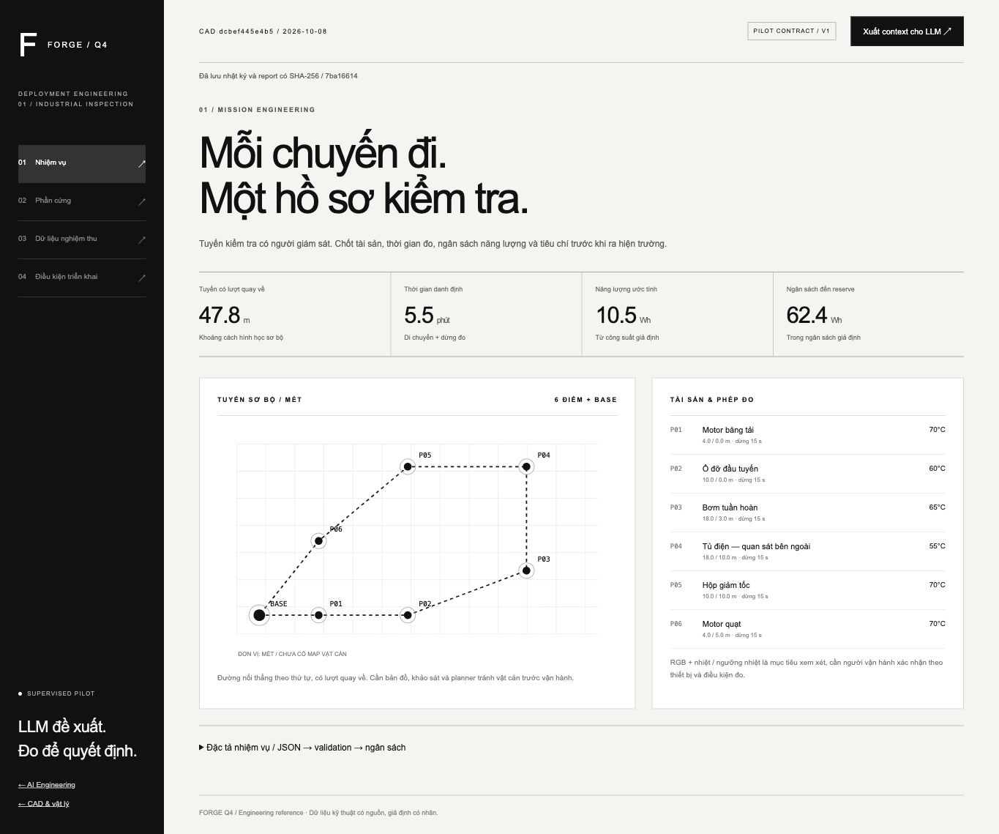
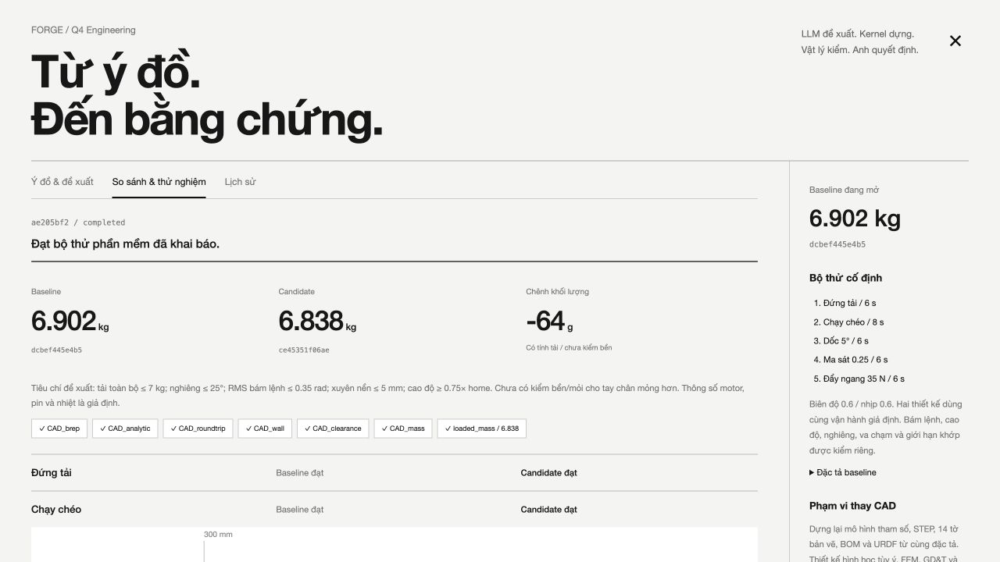
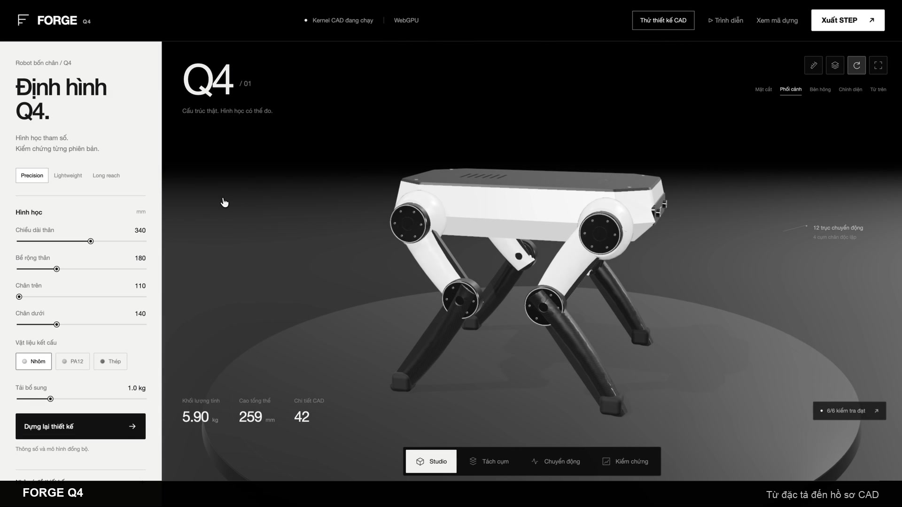
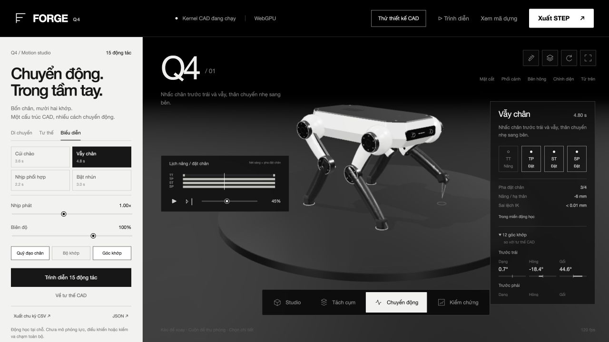

# FORGE Q4 · AI Engineering → CAD → vật lý → ROS 2

Workbench kỹ thuật chạy cục bộ: Python/build123d dựng BREP và hồ sơ CAD; tích phân STEP tạo khối lượng, tâm khối và tensor quán tính; MuJoCo giải thân tự do, servo giới hạn mô-men và tiếp xúc; Three.js hiển thị các transform đã giải. Có gói ROS 2/URDF + MJCF và telemetry để kiểm ngoài trình duyệt. Thiết kế Q4 và thông số motor vẫn là mô hình tham chiếu, chưa xác nhận bằng phần cứng.

## AI CAD Workbench: đề xuất cả cấu trúc chi tiết

**Mới: [CAD Evaluation Lab](http://127.0.0.1:8767/benchmark.html)** lưu phiên trên đĩa, sinh ba loại đề theo seed, nhận proposal JSON, kiểm yêu cầu riêng trên BREP và tái dựng họ kích thước 88/94/98 mm. Có thời gian phiên, lịch sử lỗi, đối chứng cùng task hash và ZIP với script tính lại kết quả. Mẫu tự kiểm phần mềm bị loại khỏi so sánh AI–kỹ sư; chưa có benchmark LLM thật hoặc phần cứng. [Hướng dẫn đánh giá và giới hạn đo lường](docs/CAD-EVALUATION.vi.md). Chạy `npm run test:benchmark`.

Mở [AI CAD Workbench](http://127.0.0.1:8767/feature-cad.html). Import STEP cảm biến và khai báo giao diện lắp; xuất context/feedback cho LLM bên ngoài; nhập feature graph JSON rồi dựng BREP thật. Catalog có sketch, extrude, boolean, pattern, transform, fillet và chamfer. Có xem từng feature, diff cấu trúc/tham số, baseline và STEP/DXF/PDF kèm gói tái dựng. Không gọi API LLM và không thực thi mã từ đề xuất.



[Hướng dẫn, hợp đồng JSON và phạm vi thay CAD](docs/AI-CAD-WORKBENCH.vi.md). Bộ hồi quy 10 cấu trúc + 10 chỉnh sửa do kỹ sư viết đã qua; đây chưa là benchmark chất lượng LLM. Fixture chưa xác nhận lắp Q4; geometry đạt chưa chứng minh chịu tải hoặc cho phép sản xuất. Chạy `npm run test:features` và `npm run test:feature-api`. Kết quả/job CAD cục bộ được loại khỏi Git.

## Pilot và phát triển thương mại

Mở [bàn triển khai](http://127.0.0.1:8767/deployment.html): lập tuyến inspection có người giám sát, tính ngân sách từ giả định, đối chiếu actuator có datasheet, nhập telemetry CSV gắn mission/CAD hash và xem các điều kiện còn thiếu. Có context JSON cho LLM bên ngoài; chưa gọi API AI. Bộ supervisor tham chiếu kiểm heartbeat, reserve, lỗi nhiệt và E-stop; chưa nối motor hoặc chứng nhận an toàn.



[Phương án kỹ thuật, thị trường, nghiệm thu và đầu tư](docs/COMMERCIALIZATION.vi.md). Registry CubeMars là ứng viên khảo sát, chưa lựa chọn mua. Log gắn nhãn field vẫn là người nhập khai báo; một report đạt không cấp quyền triển khai phần cứng. `npm run test:deployment` kiểm logic, dữ liệu lỗi và HTTP. Runtime `deployment-output` được loại khỏi Git.

## AI Engineering và vận hành

Mở `http://127.0.0.1:8767/?workspace=ai&backend=webgl`. Xuất context JSON cho LLM bên ngoài, nhập đề xuất, xem diff, dựng baseline/candidate và chạy 10 lượt trong 5 điều kiện. Kết quả và các lỗi được lưu theo revision. Chỉ áp dụng candidate qua mọi tiêu chí khai báo; có thể trở về baseline. Không gọi API LLM và không thực thi Python từ đề xuất.

Bật **Motor, nhiệt và pin** trong bàn Vật lý để giới hạn torque theo tốc độ/nhiệt, thử motor suy giảm, pin thấp và thermal cutoff. Điện/nhiệt là mô hình tương đương chưa hiệu chuẩn. MuJoCo cung cấp chuyển động, góc, mô-men, lực tiếp xúc thực trong mô phỏng. Không có whole-body balance controller hoặc nghiệm thu phần cứng.

[Hướng dẫn, phương pháp và phạm vi thay CAD](docs/AI-ENGINEERING.vi.md) · [Đề xuất mẫu](docs/examples/proposal-lightweight.json). Bộ kiểm bổ sung: `npm run test:operations`, `npm run test:engineering`, `npm run test:engineering-api`. Thư mục `engineering-output` là lịch sử cục bộ, được loại khỏi Git/gói nguồn; báo cáo mẫu trong `reports/robotics` được chọn để chia sẻ.



[](https://github.com/nclamvn/forge-q4-cad-as-code/releases/download/v0.1.0/FORGE-Q4-CAD-trailer-60s.mp4)

**[Tải bản CAD v0.1.0](https://github.com/nclamvn/forge-q4-cad-as-code/releases/tag/v0.1.0)** · **[Bài viết về phương pháp](docs/CAD-BANG-CODE.vi.md)** · **[Chi tiết kỹ thuật và kiểm chứng](docs/engineering-notes.md)**

## Xem ngay

Để xem bản CAD v0.1.0, tải `FORGE-Q4.html` ở release đó rồi mở bằng Chrome/Edge hiện đại. Để dùng AI Engineering và vật lý hiện tại, clone nhánh `main` và chạy server theo hướng dẫn tiếp theo. Một file có sẵn 3D, 12 cấu phần, bản vẽ, BOM, bằng chứng và các file tải; không cần CDN hoặc API key. Bản HTML là snapshot để xem và tải hồ sơ. Muốn sửa tham số rồi dựng lại cần chạy Python kernel theo hướng dẫn bên dưới.

Trailer v0.1.0 ghi lại bản CAD trước nâng cấp vật lý, có 40 cảnh, 1920×1080/60 fps. [Thông số và SHA-256](docs/media/trailer.json). Các gói đã công bố ở v0.1.0 chưa chứa workspace vật lý hiện tại.

## Chạy bản thiết kế tương tác

Cần Python **3.11–3.14**. Node.js 18+ cần để biên dịch quỹ đạo vật lý và đóng gói HTML. Đã kiểm trên Python 3.12.14 / Node.js 24.14.1 / MuJoCo 3.15.0. Server chỉ nghe trên `127.0.0.1`.

```sh
git clone https://github.com/nclamvn/forge-q4-cad-as-code.git
cd forge-q4-cad-as-code
python3 -m venv .venv
.venv/bin/python -m pip install -r requirements-simulation.txt
.venv/bin/python server.py
```

Mở [studio](http://127.0.0.1:8767/), [bàn CAD](http://127.0.0.1:8767/?workspace=cad) hoặc [hồ sơ xuất của snapshot mặc định](http://127.0.0.1:8767/deliverables.html). macOS có thể chạy `zsh Start.command`. Trên Windows dùng `.venv\Scripts\python` thay cho `.venv/bin/python`.

WebGPU khi khả dụng, dự phòng WebGL2. Thêm `?backend=webgl` để thử WebGL2 hoặc `?workspace=cad&backend=webgl` để mở bàn CAD với backend này. Có thể xoay, tách cụm, xuyên thấu, clipping 3D và chuyển động minh họa. Phím D/X/S/E/Space tương ứng kích thước/xuyên thấu/mặt cắt/tách cụm/chuyển động.

## Workspace vật lý

Mở [mô phỏng MuJoCo](http://127.0.0.1:8767/?workspace=physics). Bộ giải tích phân 500 Hz; trình duyệt nhận transform, lực và IMU đã giải. Chọn quỹ đạo, nhịp, biên độ, nền phẳng/dốc 5°/bậc, ma sát và mô-men giới hạn; bấm **Dựng và chạy vật lý**. Đổi thông số tạm dừng phiên và yêu cầu dựng lại, giúp kết quả gắn với cấu hình cụ thể.

**Đẩy ngang 35 N** áp lực trong 0,12 s; **Ngắt motor** vô hiệu actuation, trọng lực tiếp tục tác động. Motor yếu có thể làm robot sụp; trình duyệt hiển thị trạng thái thật. Xuất URDF, MJCF, tensor quán tính, gói ROS 2, report JSON và telemetry CSV 50 Hz. Gói có manifest SHA-256, revision CAD, profile giả định và 12 STL/OBJ theo SI.

**[Hướng dẫn kỹ thuật và kết quả kiểm](docs/ROBOTICS.vi.md)**. URDF đã được đọc độc lập bằng MuJoCo và đối chiếu động học với MJCF. ROS 2/colcon/RViz chưa chạy trên máy này. Bộ điều khiển hiện là servo PD theo quỹ đạo; chưa có cân bằng toàn thân, MPC, ước lượng trạng thái, driver motor hoặc hiệu chuẩn robot thật.

## Motion studio

Mở [studio chuyển động](http://127.0.0.1:8767/?workspace=motion). Thư viện có **15 chương trình**: đứng quan sát, bước chậm, chạy chéo, bước cùng bên, chạy bật, lùi, bước ngang, xoay, hạ thân, ngồi, cúi chào, vẫy chân, chuyển trọng tâm, phối hợp nhịp và bật nhún. Nút **Trình diễn 15 động tác** phát lần lượt, mỗi động tác 5 giây.

Điều chỉnh nhịp 0,25–2× và biên độ 25–135%; tạm dừng, tua chu kỳ hoặc tiến một frame. Lịch nâng/đặt chân, quỹ đạo, bộ khớp và 12 góc khớp cho phép đọc chuyển động thay vì chỉ xem animation. **Về tư thế CAD** đặt robot đúng cấu hình lắp ráp gốc. Bàn CAD, bản vẽ và chế độ tách cụm vẫn dùng hình học gốc.

Mỗi chân được giải động học nghịch cho ba khớp từ kích thước CAD. Chuyển động thân và quỹ đạo chân đi qua cùng solver; chuyển chế độ nội suy mục tiêu rồi giải lại, giữ nguyên chiều dài liên kết. Bàn chân cố định đi cùng chân dưới, không thêm một khớp cổ chân giả. Giới hạn góc trong studio là độ lệch so với tư thế CAD, chưa phải giới hạn actuator đã hiệu chuẩn.

CSV/JSON xuất một chu kỳ ở 60 Hz, gắn revision CAD, góc tuyệt đối và độ lệch từ tư thế CAD, tọa độ bàn chân và pha đặt chân dự kiến. JSON kèm đặc tả và chuyển động thân. **Đây là quỹ đạo xem trước tại chỗ; chưa có lực tiếp xúc, mô phỏng động lực học, kiểm va chạm toàn bộ hay chương trình điều khiển phần cứng.** Pha đặt chân không chứng minh ổn định và động tác bật nhún không chứng minh robot thật nhảy được.



## Thử một thao tác CAD thực sự

1. Mở bàn CAD, chọn **Q4-201 Tay chân trên**. Spec mặc định có hai tâm cách 110 mm, rộng 32 mm, dày 7 mm và lỗ Ø10 mm.
2. Bấm **Thử lỗ Ø14 / dày 5** rồi **Dựng lại CAD và bản vẽ**. Lần đầu cần dựng hình và hồ sơ; thời gian phụ thuộc máy. UI giữ thiết kế hợp lệ trước đó trong lúc chờ.
3. So trước/sau. Khối lượng một tay trên từ **78,8 g → 54,2 g**, thể tích giảm **31,2%**, theo mật độ nhôm giả định 2700 kg/m³. STEP, mặt cắt, hình chiếu, BOM và PDF cập nhật theo revision mới.
4. Thử **vành quá mỏng**. Spec bị từ chối với HTTP 422; thiết kế hợp lệ được giữ lại. Các nút xuất bị khóa khi thông số chưa đồng bộ với hình học.
5. Tải STEP/DXF/PDF mới để kiểm ngoài demo. STEP được kiểm đọc lại bằng Open Cascade; chưa thực hiện phép kiểm import độc lập trong Fusion hoặc Onshape.

## Dữ liệu có trong demo

| Đầu ra | Phạm vi |
| --- | --- |
| CAD 3D | 12 hình học BREP, mỗi hình một solid hợp lệ |
| Lắp ráp | 42 instance có tên riêng và transform |
| STEP | 12 file chi tiết và một assembly 42 solid |
| Bản vẽ | 14 tờ A3 gồm 12 chi tiết, tổng thể và phân rã |
| DXF | 48 hình chiếu, 4 view/chi tiết, đơn vị mm, nét thấy/nét khuất |
| PDF/SVG | Mặt cắt BREP, kích thước, tỷ lệ, số lượng, revision và ghi chú |
| BOM/proof | Volume, khối lượng và cơ sở tính, CoM, các gate kiểm chứng |

DXF xuất cạnh chiếu từ BREP. SVG/PDF lấy mẫu đường cong để hiển thị; STEP giữ BREP gốc. Clipping trong studio là hiệu ứng hiển thị, còn mặt cắt trên bản vẽ lấy từ phép cắt hình học thật.

## Phương pháp và giới hạn

```text
YAML / tham số UI → validation → Python / build123d / Open Cascade
                                  ├─ BREP → STEP → đọc lại, đếm solid, so volume
                                  ├─ HLR + section → DXF / SVG / PDF / BOM
                                  └─ tessellation → Three.js → WebGPU / WebGL2
```

Đặc tả và fingerprint compiler xác định revision hình học. Generator bản vẽ có fingerprint riêng. Các file của một lần dựng đi cùng revision; bản mẫu được giữ trong repo để clone xong có thể mở ngay. Git chỉ giữ snapshot mặc định `dcbef445e4b5`; các revision thử nghiệm không đưa vào Git. Snapshot cũ có thể xem lại từ lịch sử commit hoặc release v0.1.0.

AI hỗ trợ viết mã trong quá trình phát triển. **Sản phẩm chưa gọi LLM lúc chạy**. Ô ý đồ trong studio Q4 cũ dùng parser cục bộ cho tham số định trước. AI CAD Workbench mới trao đổi JSON với LLM bên ngoài và có compiler feature graph để tạo cấu trúc trong catalog, cùng brief độc lập để kiểm. Chưa có constraint solver tương tác, chỉnh mặt tùy ý hoặc feature history native khi import STEP.

Đây là hồ sơ concept của một thiết kế PoC độc lập. Actuator, pin và camera dùng hình học đại diện; một số khối lượng được gán. Chưa có GD&T, dung sai lắp, CAM, FEA, thiết kế điện, kiểm va chạm BREP chính xác toàn bộ, bộ điều khiển cân bằng toàn thân hoặc thử robot thật. Workspace vật lý có tiếp xúc convex và servo PD, với phạm vi được ghi riêng. Quy tắc vành 6 mm và khoảng hở tay chân 3 mm tại 5 góc mẫu không chứng minh độ bền hay khả năng chế tạo.

## Kiểm chứng và đóng gói

```sh
.venv/bin/python -m pip install -r requirements-test.txt
.venv/bin/python tests/kernel_test.py
.venv/bin/python tests/dossier_test.py
# Chạy khi server đang mở. Có thể chọn cổng với FORGE_TEST_URL.
.venv/bin/python tests/api_test.py
# Động học: Node.js 18+, không cần Python kernel hoặc trình duyệt.
npm run test:motion
.venv/bin/python tests/robotics_test.py
.venv/bin/python tests/physics_api_test.py
npm run test:operations
npm run test:engineering
npm run test:engineering-api
npm run test:deployment
npm run test:features
npm run test:feature-api
npm run test:benchmark
```

Bộ kiểm dùng công thức thể tích capsule độc lập, 7 loại spec lỗi, 4 biến thể thiết kế, STEP round-trip, 42 nhãn lắp ráp, 48 DXF/mm, diện tích mặt cắt và 14 trang A3. Report JSON ở `reports/`; kiểm trình duyệt trước khi phát hành ghi riêng trong `reports/monochrome/dossier-browser.json`.

Bộ kiểm chuyển động đối chiếu tư thế gốc với các instance CAD, lấy mẫu 27.000 tư thế trên 5 đặc tả và 3 biên độ, kiểm chiều dài liên kết, giới hạn độ lệch khớp, sai lệch IK, nối chu kỳ và 225 cặp chuyển tiếp. Kiểm cao độ nền dùng thêm các đỉnh mesh bàn chân thực tế của snapshot CAD. Report ở `reports/motion/kinematics.json`; những kiểm tra này chỉ xác nhận động học.

Đóng gói HTML và ZIP có manifest SHA-256 (Node.js 18+). Hãy chạy các phép kiểm trên trước khi tạo release.

```sh
npm ci
npm run package
.venv/bin/python tools/release.py
```

`tools/release.py` dùng danh sách thư mục công khai cho phép. Môi trường Python, cache phụ, bản ghi màn hình thô, video biên tập, archive và thông tin Git không vào gói chia sẻ.

## Cấu trúc

| Đường dẫn | Vai trò |
| --- | --- |
| `kernel.py`, `spec.yaml` | Hình học và đặc tả tham số |
| `technical.py` | Hình chiếu, mặt cắt, DXF và hồ sơ A3 |
| `server.py`, `launch.py`, `Start.command` | API và khởi chạy cục bộ |
| `web/` | Studio, bàn CAD, snapshot model và Three.js vendored |
| `artifacts/dcbef445e4b5/` | CAD mới: vỏ dưới tránh nền, đệm chân 32 mm, 14 tờ A3 |
| `robotics/` | Compiler SI/URDF/MJCF, solver, profile và API phiên chạy |
| `design/` | Compiler feature graph, BREP interface gates, bản vẽ và worker/API CAD |
| `design-output/`, `design-jobs/` | Hồ sơ và lịch sử CAD cục bộ, không vào Git |
| `benchmark-output/` | Task, phiên, đề xuất, kết quả và snapshot evaluator cục bộ, không vào Git |
| `robotics-output/` | Gói phát sinh theo hash mô hình, không vào Git |
| `engineering-output/` | Lịch sử và candidate thử nghiệm cục bộ, không vào Git |
| `tests/`, `reports/` | Phép kiểm và kết quả |
| `docs/` | Bài viết, kỹ thuật và media đã chọn |
| `tools/` | Đóng gói bản phát hành |

Three.js 0.186.1 được giữ kèm [MIT license của thư viện](web/vendor/THREE-LICENSE.txt). Các dependency Python được cài từ PyPI theo requirements.

Tài liệu nền tảng chính thức [build123d](https://build123d.readthedocs.io/en/latest/), [import/export và phép chiếu CAD](https://build123d.readthedocs.io/en/latest/import_export.html), [Three.js WebGPURenderer](https://threejs.org/docs/pages/WebGPURenderer.html).

## Customer engineering release

Mở `/customer.html` cho hành trình CAD → đề xuất LLM → kiểm → Q4 tích hợp → MuJoCo/URDF. Xem [phạm vi, dữ liệu và cách tái lập](docs/CUSTOMER-DEMO.vi.md). `npm run test:integration` kiểm mounting BREP, truyền mass/inertia, URDF và solver. `npm run release:customer` đóng gói chỉ khi kiểm số và browser review hiện tại khớp source. Lượt LLM có hỗ trợ trong phiên Codex; đối chứng kỹ sư đang chờ thao tác thật.
